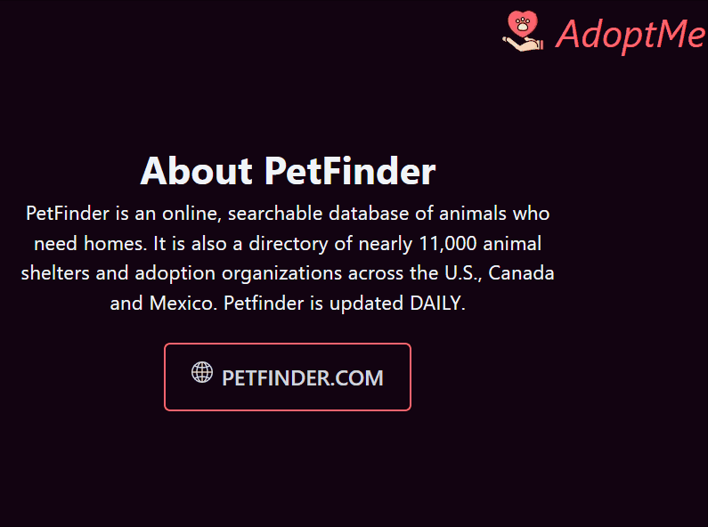

# AdoptMe

* [Informacje wstępne](#Informacje-wstępne)
* [Technologie i narzędzia](#Technologie-i-narzedzia)
* [Interfejs](#Interfejs)
* [Opis realizacji projektu](#Opis-realizacji-projektu)

## Informacje wstępne

Przedmiot: Aplikacje webowe dla urządzeń mobilnych oraz Technologie Formatkowe

Rok akademicki: 2021/2022

Grupa: S32-32

Skład zespołu: Justyna Gapys, Natalia Skórowska 

Nazwa aplikacji: Adopt Me

IDE: Visual Studio Code

Frontend: React

Framework CSS: Tailwind

Cel aplikacji: Aplikacja "Adopt me" umożliwia przegląd katalogu ze zwierzętami, które czekają na adopcję. Wykorzystane API jest aktualizowane codziennie, dzięki temu na stronie głównej aplikacja wyświetla informacje o dwudziestu ostatnio dodanych zwierzętach. Istnieje także możliwość filtrowania zwierząt ze względu na 6 rodzajów: psy, koty, króliki, ptaki, konie oraz zwierzęta gospodarskie.

## Technologie i narzędzia

|ID | Nazwa | Zastosowanie |
| ------------- | ------------- |------|
| 1 | React  | Frontend - wykorzystanie useState, useEffect, createContext |
| 2 | Next.js  | Routing w aplikacji (zamiast react router) - wykorzystanie next/image, next/link, next/router |
| 3 | Tailwind  | FrameworkCSS - własne stylowanie, zdefiniowane własne kolory oraz animacje elementów np. ruchome ikony w panelu nawigacji |
| 4 | React icons  | Ikony znajdujące się w zakładce 'About Us' oraz w panelu nawigacyjnym |
| 5 | React Simple-Image-Slider  | Karuzela ze zdjęciami w zakładce 'About Us' |
| 6 | React Tooltip  | Tooltip  ukazujący się po najechaniu na button w zakładce 'About Us' |
| 7 | Material UI  | Cardy znajdujące się w zakładce 'About Us', Grid na stronie głównej, CircularProgress |
| 8 | API  | PetFinder |

## Interfejs

Strona główna:

Panel nawigacyjny:

Strona danego gatunku:

Zakładka About Us:

Slider ze zdjęciami zwierząt z każdej kategorii w zakładce 'About Us':

Tooltip ukazujący się po najechaniu na przycisk:

Animacja ikony w wypadku braku zdjęcia zwierzaka:

CircularProgress wyświetlający się podczas ładowania strony:

Dedykowana strona błędu:

## Opis realizacji projektu

1. Stworzenie React App, logo aplikacji oraz podpięcie wybranego api wraz z kluczami w pliku oauth-token.js.

2. Zaimplementowanie funkcji GetAnimals odpowiedzialnej za pobieranie  danych o ostatnio dodanych zwierzętach wraz z uwzględnieniem danego gatunku zwierząt.

3. Konfiguracja mechanizmu routingu z wykorzystaniem Next.js oraz stworzenie panelu nawigacyjnego:

4. Stylowanie strony głównej, wykorzystanie Grida z Reacta oraz Talwinda. Na stronie głównej jednorazowo wyświetla się 20 ostatnio dodanych zwierząt, kafelek z pojedynczym zwierzęciem zawiera jego zdjęcie, imię, informację o płci, wieku i wielkości oraz krótki opis jeśli taki został dodany.
Po naciśnięciu na button "Adopt me" przy danym zwierzaku użytkownik zostaje przekierowany do strony danego zwierzeka na portalu petfinder.com gdzie można dokonać adopcji.

5.Stworzenie globalnego koloru tła i własnych kolorów z użyciem Tailwinda

6.Stworzenie dedykowanej strony błędu:

7. Stylowanie zakładki 'About Us':
- Slider ze zdjęciami wszystkich gatunków zwierząt dostępnych do adopcji. Karuzela za zdjęciami zmienia się sama, ale można tego dokonać także ręcznie
- 4 Cardy zawierające informacje o PetFinder. W nich zastosowane react-icons oraz gradient na tło nagłówka
- Przycisk "Petfinder.com", który po naciśnięciu przenosi użytkownika na stronę główną petfinder.com
- Do wyżej opisanego przycisku zaimplementowany Tooltip wyświetlający się po najechaniu na przycisk

